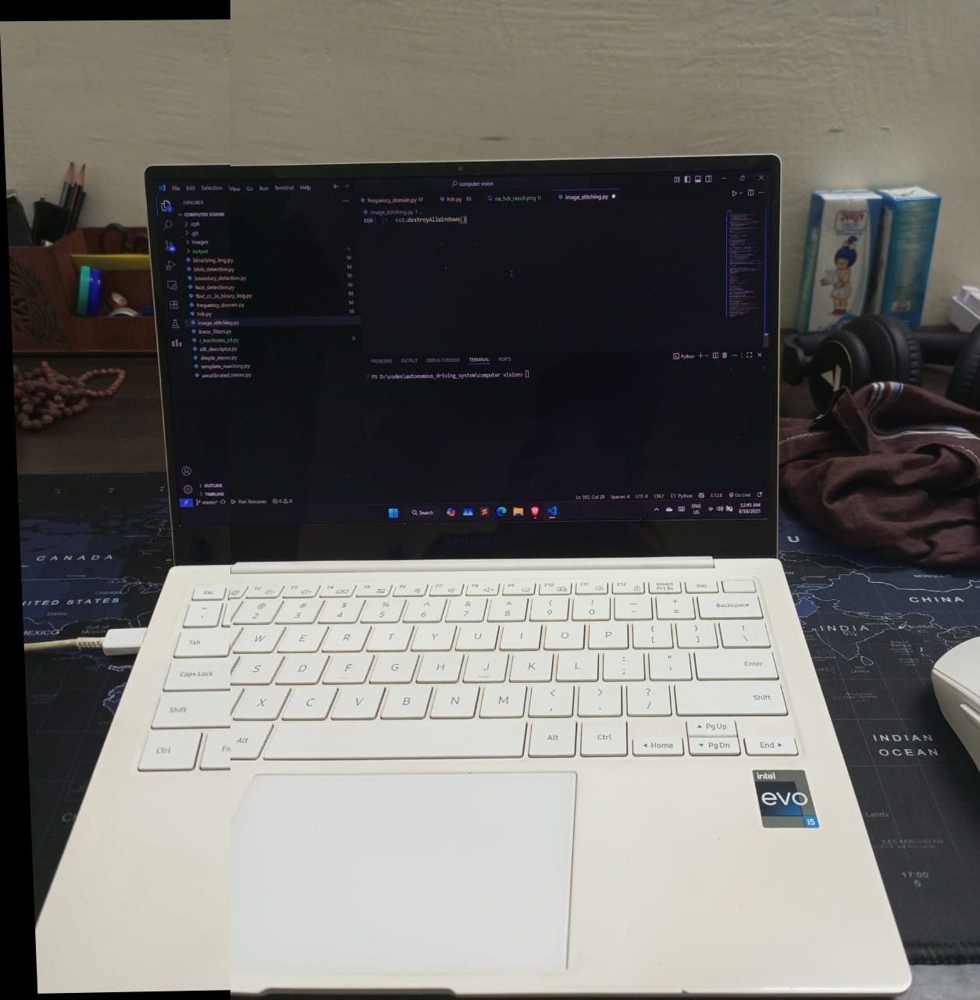
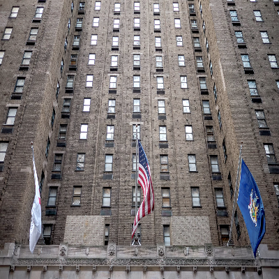
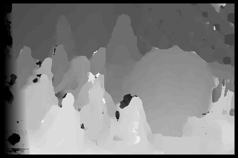
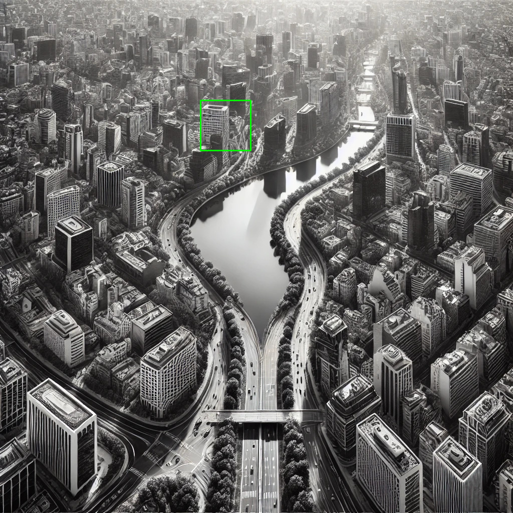
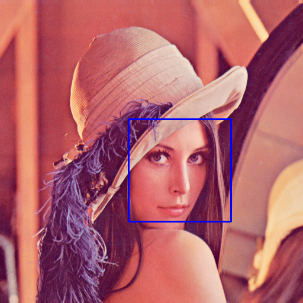
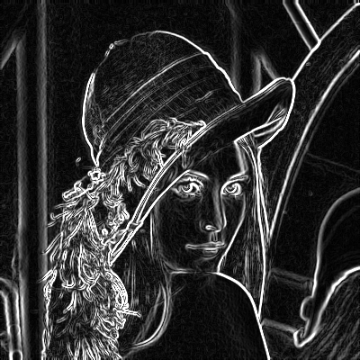
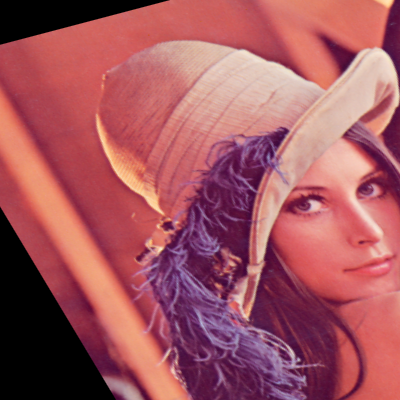
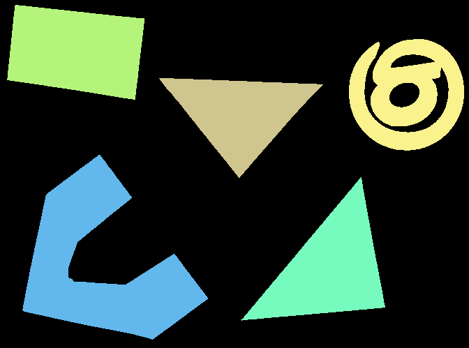

# Computer Vision Algorithms and Techniques

 

This repository contains a collection of Python scripts that implement various fundamental computer vision algorithms from scratch or using libraries like OpenCV and Scikit-Image. Each script is designed to be a clear, self-contained example of a specific technique.

## Table of Contents
1.  [Feature Detection & Image Stitching](#feature-detection--image-stitching)
2.  [High Dynamic Range (HDR) Imaging](#high-dynamic-range-hdr-imaging)
3.  [Active Contour Model (Snakes)](#active-contour-model-snakes)
4.  [Stereo Disparity Map Generation](#stereo-disparity-map-generation)
5.  [Template Matching](#template-matching)
6.  [Face Detection](#face-detection)
7.  [Image Filters & Geometric Transformations](#image-filters--geometric-transformations)
8.  [Connected Components Analysis](#connected-components-analysis)
9.  [Frequency Domain Transformation (DFT)](#frequency-domain-transformation-dft)
10. [Setup and Usage](#setup-and-usage)

---

### Feature Detection & Image Stitching
This script demonstrates a complete pipeline for creating a panoramic image from two overlapping photos.

**Process:**
1.  **Feature Detection:** Uses the Scale-Invariant Feature Transform (SIFT) to find distinctive keypoints in both images.
2.  **Feature Matching:** Applies Lowe's ratio test with a Brute-Force matcher to find reliable correspondences between the keypoints.
3.  **Homography Estimation:** Uses the RANSAC algorithm to filter outliers and compute the homography matrix that maps one image's perspective to the other.
4.  **Warping & Stitching:** Transforms one image using the homography matrix and stitches it together with the second image to create a seamless panorama.

**RANSAC Filtered Matches:**


**Final Stitched Image:**


---

### High Dynamic Range (HDR) Imaging
This script merges multiple images taken at different exposure levels into a single High Dynamic Range (HDR) image to retain detail in both the darkest and brightest areas.

**Process:**
The implementation uses Mertens fusion, which intelligently combines the best-exposed parts of each source image (underexposed, normal, and overexposed) into a final, well-balanced result.

**HDR Result:**


---

### Active Contour Model (Snakes)
This script implements the Active Contour Model to segment an object in an image.

**Process:**
An initial contour is defined around an object. The algorithm then iteratively deforms this contour, pulling it towards the object's edges until it tightly fits the boundary, effectively isolating the object from the background.

**Snake Contour Result:**


---

### Stereo Disparity Map Generation
This script manually computes a depth map from a pair of stereo images (left and right).

**Process:**
It uses a block-matching algorithm with a **Sum of Absolute Differences (SAD)** cost function to find corresponding pixel blocks. The horizontal shift (disparity) is then calculated, where a larger disparity indicates that an object is closer to the camera, creating a 2.5D representation of the scene.

**Manual Disparity Map:**


---

### Template Matching
This script finds the location of a small template image within a larger source image.

**Process:**
It demonstrates both a manual sliding window approach using **Sum of Squared Differences (SSD)** and the highly optimized `cv2.matchTemplate` function to locate the region in the main image that is most similar to the template.

**Template Matching Result:**


---

### Face Detection
A classic computer vision task, this script uses a pre-trained Haar Cascade classifier to detect human faces in an image and draws a bounding box around each one.

**Face Detection Result:**


---

### Image Filters & Geometric Transformations
This script showcases a variety of common image processing operations.

* **Linear Filters:** Includes smoothing filters (Box, Gaussian) and edge detection filters (Sobel, Laplacian).
* **Geometric Transformations:** Demonstrates how to translate, rotate, and apply complex affine transformations to an image using OpenCV's optimized functions.

**Sobel Edge Detection:**


**Affine Transformation:**


---

### Connected Components Analysis
This script implements a manual algorithm to find and label all distinct, connected regions of pixels in a binary image.

**Process:**
It uses a Depth-First Search (DFS) approach to traverse and label each component, effectively counting the number of separate objects in the image and color-coding them for visualization.

**Connected Components Result:**


---

### Frequency Domain Transformation (DFT)
This script converts an image from the spatial domain to the frequency domain using a manual implementation of the 2D Discrete Fourier Transform (DFT). The resulting magnitude spectrum shows the image's frequency components, with low frequencies (general structure) at the center and high frequencies (fine details) towards the edges.

**DFT Magnitude Spectrum:**


---

### Setup and Usage
1.  **Dependencies:** Ensure you have the required Python libraries installed:
    ```bash
    pip install opencv-python numpy scikit-image
    ```
2.  **Directory Structure:** The scripts expect the following directory layout:
    ```
    .
    ├── images/
    │   ├── image_l.jpg
    │   ├── image_r.jpg
    │   └── ... (all other source images)
    ├── output/
    │   └── ... (all result images will be saved here)
    ├── image_stitching.py
    ├── hdr_merging.py
    └── ... (all other python scripts)
    ```
3.  **Running a Script:** Execute any script from your terminal:
    ```bash
    python image_stitching.py
    ```
